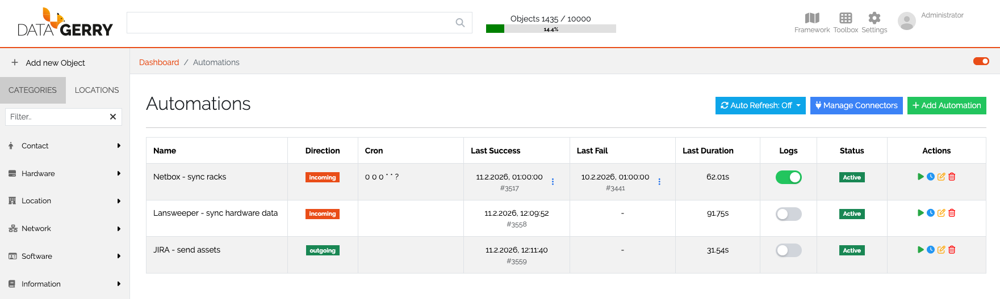

****
Automations
****

.. _automations-anchor:

.. contents:: Table of Contents
    :local:

=======================================================================================================================

| 

Generell
====================

The **Automations** feature in DataGerry allows you to create and manage interfaces directly through the user interface. In the background, `OpenCelium <https://opencelium.io>`_ is used to handle the connections to external systems, making it easy to automate tasks and manage integrations. 

|

Terminology
-----------

**Automation**

An **Automation** in Datagerry is a combination of a *Connection* and a *Scheduler entry*.  
It defines a task that runs according to a defined schedule and interacts with a data source via a connection.

|

**Automation-IDE**

The **Automation-IDE** (in OpenCelium called *Connection Editor*) is the interface where Automations are created, edited, and managed.  
Templates can be loaded within the Automation-IDE as starting points for new Automations.  
After loading, templates can be modified and saved.

| 

Self-Hosted vs. Cloud
----------------------

- **Self-Hosted**: In the Self-Hosted version of DataGerry, you can access the `OpenCelium <https://opencelium.io>`_ license overview. This allows you to manage and monitor the licenses being used.
  
- **Cloud**: In the Cloud version of DataGerry, licenses are automatically assigned to users when they use DataGerry in the cloud. Therefore, the license overview is not relevant in this version.

| 

=======================================================================================================================
| 

Automation Overview
====================

| 

    Picture: Automation overview

| 

Accessing Automations
----------------------

To access **Automations**, navigate to the **Toolbox** menu in the DataGerry dashboard, and select the **Automations** sub-menu. You will be presented with a table displaying all created automations, which includes the following key information:

- **Name**: The name of the automation.
- **Direction (Data Flow Direction)**: Defines the direction of the interface—either **Incoming**, **Outgoing**, or **Internal**.
- **Cron Expression**: The time-based configuration that defines how frequently the automation will run.
- **Last Success**: The last successful execution time of the automation.
- **Last Failure**: The last time the automation failed.
- **Last Duration**: The duration of the last automation run.
- **Logs**: Logs that can be toggled on or off for monitoring the automation’s activity.
- **Status**: The current status of the automation (active, inactive, etc.).
- **Action List**: Here, you can start, edit, adjust the cron expression, or delete the automation.

| 

=======================================================================================================================

Automation Refresh
-------------------

You can enable **auto-refresh** for the Automations page, which ensures that you are always seeing the most up-to-date status and data related to your automations.

|

=======================================================================================================================

Managing Connectors
-------------------

In the **Automations** section, you can manage and configure **connectors**. You can modify existing connections or create new ones to send or receive data from various sources.

|

=======================================================================================================================

Add Automation
--------------------------

### Steps to create a new automation:

1. Click on **Create New Automation**.
2. A form will open asking for the following details:
   - **Name** of the automation.
   - **Description** (optional).
   - **Direction of Data Flow**: Choose the desired data flow direction (**incoming**, **outgoing**, or **internal**).
   - **Get/Send data from/to Connector:**: Select the connector through which you want to send or receive data.
   - **Use a predefined interface template:**: The available predifined templates are loaded based on the selection of the connector and the direction of the data flow. A template is a predefined interface blueprint that can be loaded in the Automation-IDE. It serves as a starting point to quickly display an interface. After loading, the template can be modified and customized, and then saved.
|

=======================================================================================================================

Documentation and Further Help
------------------------------

For more detailed information on the **Automations** feature in DataGerry and the `OpenCelium <https://opencelium.io>`_ integration, please refer to the `OpenCelium Documentation <https://docs.opencelium.io>`_.

