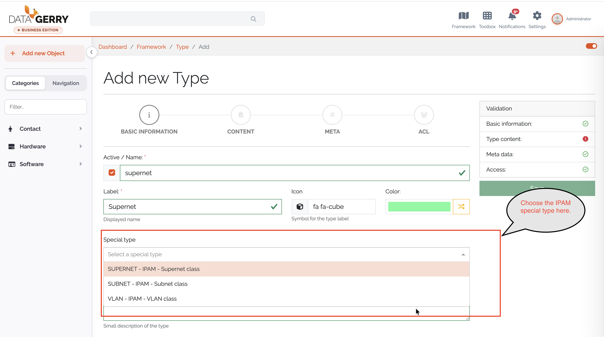
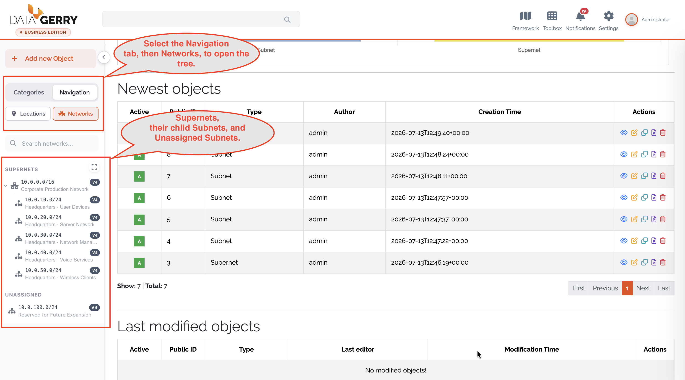
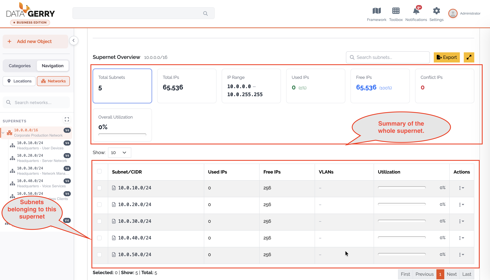
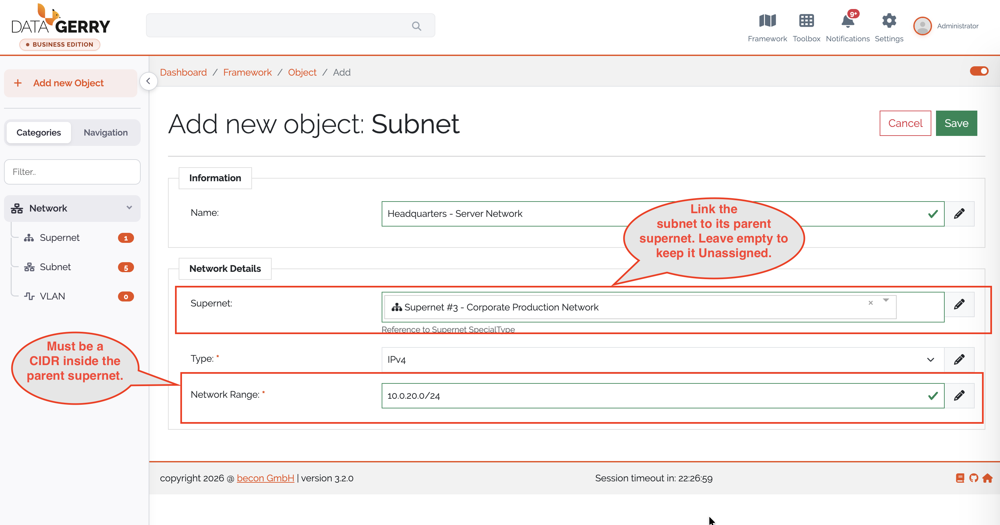
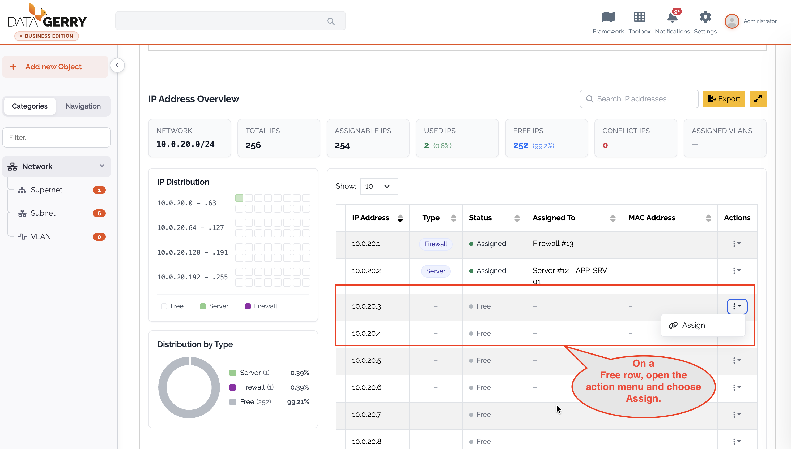
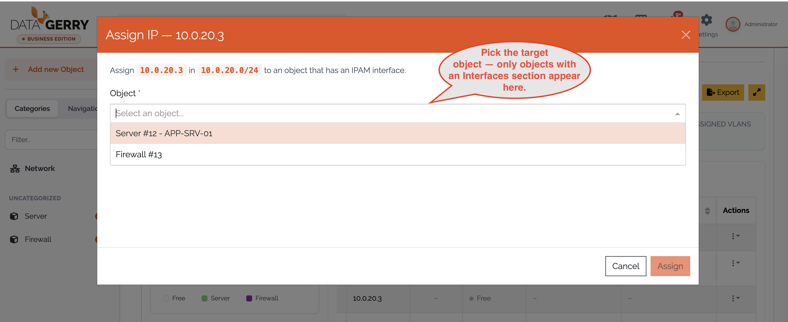
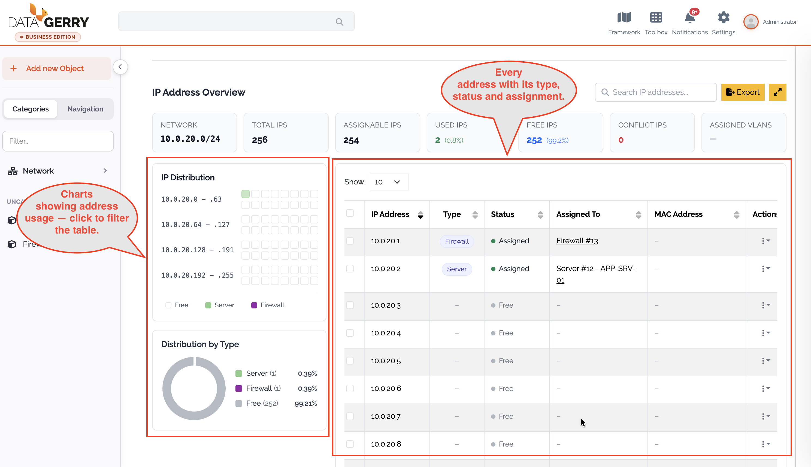
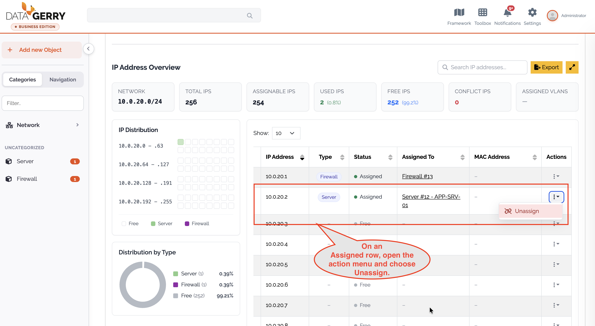

****
IPAM
****

.. _ipam-anchor:

.. contents:: Table of Contents
    :local:

=======================================================================================================================

**IP Address Management (IPAM)** lets you model and track your entire IP address space directly inside the CMDB.
You register large network blocks (**Supernets**), divide them into **Subnets**, and see at a glance which
individual IP addresses are in use or free — and which object each used address belongs to. Because IPAM is built
on top of the regular :ref:`Types <types-anchor>` and :ref:`Objects <objects-anchor>`, assigning an IP address to a
device is the same act as recording it in DataGerry.

.. note::
    IPAM is a premium feature of the **Self-Hosted Edition**. On an on-premise installation it must be unlocked
    through :ref:`License Management <license-management-anchor>`. In the Cloud Edition it is available depending on
    your subscription. Without the required license, IPAM views are shown as read-only with an *Upgrade to unlock*
    hint.

|

=======================================================================================================================

|

Concepts
========

IPAM does not use a separate data store. Its entities are ordinary DataGerry :ref:`Objects <objects-anchor>` based on
dedicated **special types**. When you create the IPAM types (see :ref:`Setting up IPAM <ipam-setup-anchor>`), the
reference fields between them are wired automatically.

- **Supernet** – A top-level network block (e.g. ``10.0.0.0/8``). It defines an address family (IPv4 or IPv6) and a
  network range in CIDR notation.
- **Subnet** – A network range contained within a Supernet (e.g. ``10.0.1.0/24``). A Subnet may optionally reference a
  parent Supernet; a Subnet without a parent is listed as *Unassigned*.
- **VLAN** – An optional entity referencing a Subnet, used to record VLAN information (Static / Dynamic).
- **Interface** – The predefined **Interfaces** :ref:`Section Template <section-templates-anchor>`
  (a :ref:`Multi-Data Section <mds-anchor>`). This is how a regular object (server, client, router, …) claims one or
  more IP addresses. An address counts as *used* precisely when an interface entry on some object references its
  subnet and holds that IP.

The entities relate through standard reference fields: **Subnet → Supernet**, **VLAN → Subnet** and
**Interface → Subnet**.

|

=======================================================================================================================

|

.. _ipam-setup-anchor:

Setting up IPAM
===============

Before you can manage addresses, the three IPAM special types (**Supernet**, **Subnet**, **VLAN**) must exist. You
have two options:

- **DataGerry Assistant** – The :ref:`DataGerry Assistant <datagerry-assistant-anchor>` provides an **IPAM** profile
  that creates the Supernet, Subnet and VLAN types (in this order, so their cross-references wire up correctly) inside
  a *Network* category.
- **Type Builder** – When creating a new :ref:`Type <types-anchor>`, use the **Special type** selector in the basic
  step to mark the type as *Supernet*, *Subnet* or *VLAN*.

    Picture: Marking a type as an IPAM special type in the Type Builder

.. figure:: img/ipam/ipam_setup_special_type_2.png
    :width: 800

    Picture: Marking a type as an IPAM special type in the Type Builder 2

|

=======================================================================================================================

|

Navigating IPAM
===============

Open the **Networks** tree in the left sidebar: select the **Navigation** tab, then the **Networks** sub-tab. The tree
lists all **Supernets** (expandable to their child subnets) and an **Unassigned** section for subnets without a parent
supernet. Each node shows its CIDR, an IPv4/IPv6 badge and the object name, and a *Search networks…* box helps you
locate an entry.

Clicking a node opens the corresponding object view. IPAM has no separate page — the overviews render inside the
standard object view, below the object's attributes:

- Opening a **Supernet** object shows the **Supernet Overview**.
- Opening a **Subnet** object shows the **IP Address Overview**.

    Picture: The Networks tree in the sidebar

|

=======================================================================================================================

|

Registering a Supernet
=======================

1. Create a new object of your **Supernet** type (**Add Object** → select the Supernet type).
2. Fill in the fields:

   - **Name** – A descriptive name for the network block.
   - **Type** – The address family, *IPv4* or *IPv6* (required).
   - **Network Range** – The network in canonical CIDR notation, e.g. ``10.0.0.0/8`` (required).

3. Save the object. DataGerry validates that the range is a canonical CIDR and that the selected **Type** matches the
   family of the range.

Open the saved Supernet to view its overview.

|

Supernet Overview
-----------------

The Supernet Overview summarizes the utilization of the whole block and lists its subnets.

- **Key figures** – Total Subnets, Total IPs, IP Range (first–last address), Used IPs, Free IPs and **Conflict IPs**.
  For IPv4 supernets an **Overall Utilization** bar is also shown. (Percentages and utilization are omitted for IPv6,
  where they are not meaningful against the address space size.)
- **Subnet table** – Lists the child subnets with their CIDR, Used IPs, Free IPs, VLANs and (IPv4 only) Utilization.
  The table is a lazily expandable tree; child subnets are loaded when you expand a row. A *Search subnets…* box and an
  **Export** button (CSV) are available.
- **Unassign subnets** – Use the per-row action, or select multiple rows and use the bulk action, to remove subnets
  from this supernet. After confirmation the subnet's parent reference is cleared and the subnet becomes *Unassigned*
  (it is not deleted).

    Picture: Supernet Overview

|

=======================================================================================================================

|

Registering a Subnet
=====================

1. Create a new object of your **Subnet** type.
2. Fill in the fields:

   - **Name** – A descriptive name.
   - **Supernet** – (Optional) the parent Supernet. A subnet without a parent is listed as *Unassigned*.
   - **Type** – The address family, *IPv4* or *IPv6* (required).
   - **Network Range** – The subnet in canonical CIDR notation, e.g. ``10.0.1.0/24`` (required).

3. Save the object.

While you edit the **Network Range**, DataGerry validates it live against the backend. The range must be a canonical
CIDR whose family matches the selected **Type**, and — if a parent Supernet is set — it must be contained within that
supernet and must not overlap any sibling subnet under the same supernet. The same rules are enforced when the object
is saved.

    Picture: Creating a subnet with live network-range validation

|

IP Address Overview
-------------------

Opening a Subnet object shows the **IP Address Overview**, which lists every address of the subnet and its status.

- **Key figures** – Network (CIDR), Total IPs, Assignable IPs, Used IPs, Free IPs, **Conflict IPs** and **Assigned
  VLANs**.
- **Distribution charts** – An **IP distribution** heatmap and a **Type distribution** chart visualize how the address
  space is used.
- **IP table** – Columns for IP Address, Type, Status, Assigned To, MAC Address and Actions. All columns except Actions
  are sortable; free addresses always sort last.

You can narrow down the table in several ways:

- Click a sector in the **IP distribution** chart to drill down into that address range.
- Click a type in the **Type distribution** chart to filter by type (multiple types can be selected).
- Toggle **Free** to show only unused addresses.
- Use the **Search** box (minimum two characters) to search the whole subnet.
- Click the **Conflict IPs** card to show only conflicting addresses (see :ref:`Conflicts <ipam-conflicts-anchor>`).

An **Export** button provides the IP list as CSV.

.. figure:: img/ipam/ipam_ip_overview.png
    :width: 800

    Picture: IP Address Overview

|

=======================================================================================================================

|

Assigning an IP address
=======================

You can assign a **free** address from the IP table to an existing object:

1. In the IP Address Overview, locate a row whose status is **Free** and choose its **Assign** action.
2. In the **Assign IP** dialog, select the target **Object**. Only objects that contain an **Interfaces** section can
   be selected.
3. DataGerry pre-fills a new interface entry for the chosen object with **Active**, the derived **Type** (address
   family), the **Subnet** and the **IP address**. These three fields are locked; you may fill in the remaining fields
   (**Hostname**, **Domain**, **MAC-Address**).
4. Click **Assign**. The new interface entry is added to the object and the object is saved. Existing interfaces remain
   untouched.

    Picture: Assigning a free IP address to an object

    Picture: Assigning a free IP address to an object 2

    Picture: Assigning a free IP address to an object 3

|

Unassigning an IP address
--------------------------

For a row that has an owner (**Assigned To**), choose the **Unassign** action (single rows or a bulk selection). The
dialog offers two modes:

- **Subnet** (default) – Frees the IP address but keeps the interface entry on the object (only the subnet reference is
  cleared).
- **Interface entry** – Removes the whole interface entry from the object.

    Picture: Unassigning an IP address

|

Assigning a subnet on an object's interface
-------------------------------------------

You can also manage addresses directly on any object that has the **Interfaces** section. Each interface row contains:

- **Active** – Whether the interface entry is active.
- **Type** – Address family (IPv4 / IPv6). It determines which subnets are offered.
- **Network** – A subnet picker filtered by the selected **Type**.
- **IP-Address** – The IP address (validated).
- **Hostname**, **Domain**, **Mac-Address** – Additional interface details.

Changing the **Type** clears the current subnet selection and reloads the list of matching subnets.

|

=======================================================================================================================

|

Validation rules
=================

DataGerry enforces the following rules consistently in the UI and on the server:

- **CIDR** – Ranges must be canonical (host bits zero, e.g. ``10.0.0.0/24`` is valid, ``10.0.0.5/24`` is not). The
  prefix length must be an integer (``/0``–``/32`` for IPv4, ``/0``–``/128`` for IPv6).
- **IP addresses** – Must be canonical IPv4 (dotted-quad) or IPv6 addresses. IPv6 addresses are normalized on save so
  that uniqueness checks are exact.
- **MAC addresses** – Accepted as colon/hyphen-separated (``00:1A:2B:3C:4D:5E``) or Cisco dotted (``001a.2b3c.4d5e``)
  notation.
- **Address counting** – *Assignable IPs* excludes the network and broadcast addresses for IPv4 subnets (``/30`` and
  larger blocks); ``/31`` and ``/32`` are handled per RFC 3021. For IPv6, all addresses are assignable.
- **Uniqueness** – Within a subnet an IP address may be assigned only once across all objects' interface entries.

|

=======================================================================================================================

|

.. _ipam-conflicts-anchor:

Notes and limitations
=====================

- **Conflicts** – Editing a Supernet's or Subnet's network range is allowed even if it leaves child subnets or
  assigned IP addresses outside the new range. Such entries are afterwards flagged as **Conflict** (invalid) so that
  you can repair or unassign them. The number of conflicts is shown on the **Conflict IPs** card.
- **Delete guards** – A Supernet cannot be deleted while any subnet references it, and a Subnet cannot be deleted while
  any VLAN or interface entry references it. VLANs can always be deleted.
- **IPv6** – Percentages and utilization bars are hidden for IPv6, and large counts are shown in a compact form.
- **Very large IPv4 subnets** – For subnets larger than ``/12``, search, sorting and filtering in the IP table are
  disabled for performance reasons; you can still browse the addresses in ascending order.
- **Assignment prerequisite** – An object can only receive an IP address if it contains an **Interfaces** section.

|
