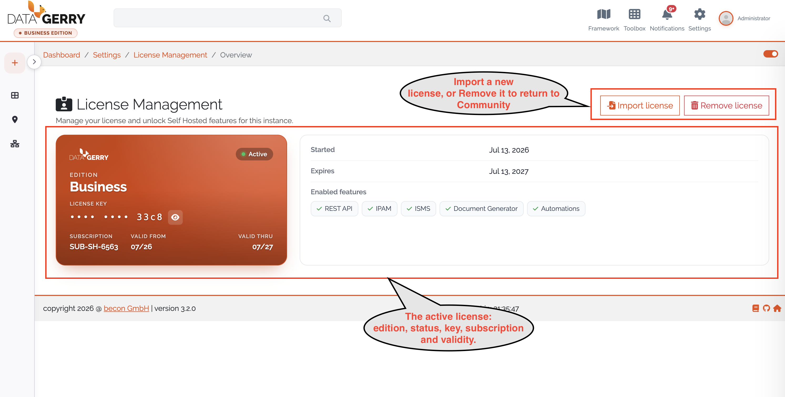
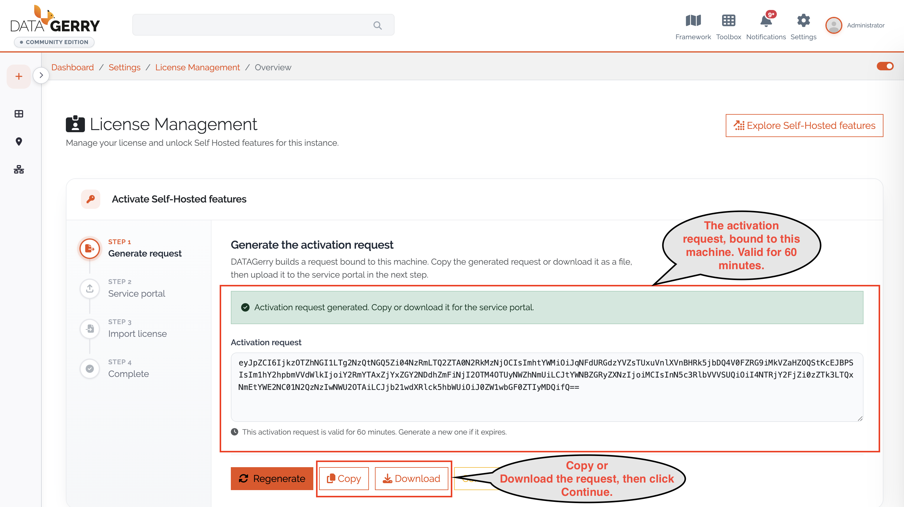
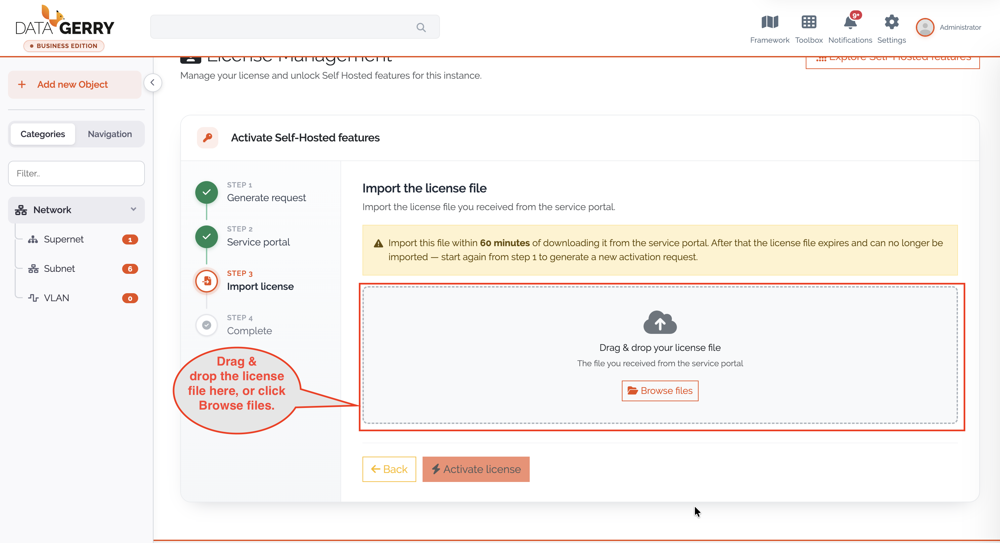
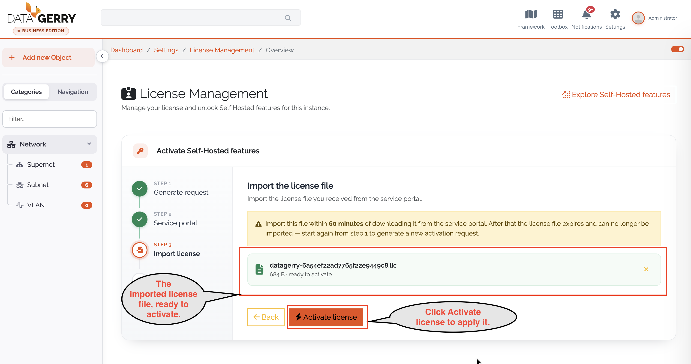

******************
License Management
******************

.. _license-management-anchor:

.. contents:: Table of Contents
    :local:

=======================================================================================================================

**License Management** lets an administrator turn a Community (free) DataGerry instance into the **Self-Hosted
Edition** and unlock its premium features. You generate a machine-bound *activation request*, exchange it for a
license file in the DataGerry service portal, and import that file to activate the license. The page also shows the
status of the current license and lets you remove it.

.. note::
    License Management is available on **on-premise installations only**. In the Cloud Edition all licensed features
    are managed by your subscription, so the page is not shown. Access additionally requires the ``base.license.view``
    permission.

|

=======================================================================================================================

|

Premium features
================

The Self-Hosted Edition unlocks the following premium features. Which of them a license enables depends on the license
it carries:

- **REST API**
- **IPAM** – see :ref:`IPAM <ipam-anchor>`
- **ISMS** – see :ref:`ISMS <isms-anchor>`
- **Document Generator** – see :ref:`Document Generator <document-generator-anchor>`
- **Automations** – see :ref:`Automations <automations-anchor>`

Any feature not covered by the active license remains locked and is marked with a **Pro** badge. Opening a locked
feature shows an upgrade dialog that links back to this page.

|

=======================================================================================================================

|

Opening License Management
==========================

Navigate to **Settings → License Management** (``/settings/license``).

Depending on the current license state, the page opens in one of two modes:

- On a **Community** or **Expired** instance it opens directly in the :ref:`activation wizard
  <license-activation-anchor>`.
- On an active **Self-Hosted** instance it shows the :ref:`license overview <license-overview-anchor>`.

|

=======================================================================================================================

|

.. _license-overview-anchor:

Viewing the current license
===========================

On an activated instance the **license overview** card shows the key details of the active license:

- **Edition** and **Tier**
- **Status** (Active / Expired)
- **License key** – masked to the last four characters; use the eye toggle to reveal the full key
- **Subscription ID**
- **Validity** – valid-from / valid-thru dates (perpetual licenses show ∞)
- **Enabled features** – the premium features unlocked by this license

If the stored license fails verification, a warning with a status-specific message is shown above the card (for
example *License expired* or *License not recognized on this machine*).

From the overview header you can:

- **Import license** – re-enter the activation wizard to import a new license file (requires ``base.license.edit``).
- **Remove license** – after confirmation, delete the license and return the instance to the Community edition
  (requires ``base.license.delete``).

    Picture: License overview of an activated instance

.. warning::
    Removing a license immediately disables all Self-Hosted features and reverts the instance to the Community
    edition.

|

=======================================================================================================================

|

.. _license-activation-anchor:

Activating a license
====================

The activation wizard guides you through four steps. The stepper on the left shows your progress.

|

Step 1 – Generate request
--------------------------

Click **Generate activation request**. DataGerry creates a request that is bound to this machine and displays it as a
Base64 text block. You can **Copy** it to the clipboard or **Download** it as ``datagerry-activation-request.txt``.

.. note::
    The activation request is valid for **60 minutes**.

Click **Continue** to proceed.

    Picture: Generating the activation request

|

Step 2 – Service portal
------------------------

Open the DataGerry service portal at `service.datagerry.com <https://service.datagerry.com>`_, go to the license
management section, upload (or paste) the activation request, and download the resulting **license file**. Then click
**I have my license file**.

|

Step 3 – Import license
------------------------

Drag and drop the license file into the drop zone, or click to browse for it. Once a file is selected, click
**Activate license**.

.. warning::
    Import the license file within **60 minutes** of generating it in the portal. After that it expires and you must
    start again from Step 1.

    Picture: Importing the license file 1

    Picture: Importing the license file 2

    Picture: Importing the license file 3

|

Step 4 – Complete
-----------------

After a successful import the wizard confirms that the license is verified and that all licensed features are now
active. Click **Finish** to close the wizard. The unlocked features become available immediately, without reloading
the application.

|

=======================================================================================================================

|

Exploring premium features
==========================

On a locked instance the header offers **Explore Self-Hosted features**, which opens a catalogue of the premium
features grouped by category. Tier filter chips highlight which features each tier includes. The catalogue is
informational — use **Activate** to switch to the activation flow.

.. note::
    The catalogue is for information only. The features an instance actually has are determined solely by the active
    license and enforced by the server.

|

=======================================================================================================================

|

License states
==============

The instance edition is derived from the license:

- **Community** – No valid license; only the core CMDB features are available.
- **Self-Hosted** – An active, verified license; the licensed premium features are unlocked.
- **Expired** – A stored license whose validity period has ended; premium features are disabled until the license is
  renewed and re-imported.

When a stored license cannot be verified, the page shows one of the following:

- **License could not be verified** – The file is corrupted or malformed; import a valid license file.
- **License not recognized on this machine** – The license does not match this machine's fingerprint; generate a new
  activation request and have the license re-issued.
- **License not active yet** – The license start date lies in the future.
- **License expired** – The validity period has ended; renew and re-import.

.. note::
    Licenses are bound to the machine they are activated on. Moving a license to a different machine requires a new
    activation request and a re-issued license file.

|
